## 什么是依赖类型

传统的静态类型语言对类型和值有明确的区分，对于类型信息可以出现在哪也有严格的限制。而在支持依赖类型（dependent type）的语言里，类型和值之间的界限变得模糊，类型可以像值一样被计算（即所谓的 first-class 类型 [^1]），同时值也可以出现在类型信息里，“依赖”两个字指的就是类型可以依赖于值。因此类型和值之间不再是单向的而变成了双向的描述关系。支持依赖类型的好处一是类型系统变得更加强大，可以检测并阻止更多的错误类型，让程序更可靠；二是依赖类型可以让计算机像运行传统的程序一样来运行数学证明 [^2]，从而在逻辑上保证程序关键属性的成立。

为了对依赖类型有一个直观的感受，举一个假想的例子。假如 Java 中加入了对依赖类型的支持，那么以 Java 的数组类型为例，可以让它包含更多的信息，比如数组的长度：

```java
String[3] threeNames = {"张三", "赵四", "成吉思汗"}; // 虚构的语法
```

这么做的好处是，所有围绕于数组类型的方法现在都可以在类型信息中包含更具体的对行为的描述。比如合并两个数组的函数`concat`的签名可以写成：

```java
String[n + m] concat(String[n] start, String[m] end) {...} // 虚构的语法
```

这里通过类型就可以知道`concat`返回的数组的长度是两个参数数组长度的和。这样不仅程序变得更易读，所有可以借由数组长度反映出来的程序错误都能在运行前被检测出来（后面会有实例说明）。再举一个 first-class 类型的例子，下面是用 [Idris](https://www.idris-lang.org/) 写的一个程序片段，Idris 是一个支持依赖类型、和 Haskell 非常接近的语言。

```idris
StringOrInt : Bool -> Type
StringOrInt x = case x of
  True => Int
  False => String

getStringOrInt : (x : Bool) -> StringOrInt x
getStringOrInt x = case x of
  True => 42
  False => "Fourty two"

valToString : (x : Bool) -> StringOrInt x -> String
valToString x val = case x of
  True => cast val
  False => val
```

这段程序的第 1、6、11 行分别声明了三个函数`StringOrInt`、`getStringOrInt`和`valToString`的类型。`StringOrInt`接受一个布尔类型的参数，返回值的类型是`Type`（也就是**类型的类型**，因为类型也是一种值），当参数是`True`，返回`Int`类型，参数为`False`时，返回`String`类型。而在`getStringOrInt`的类型声明中可以看到它的返回值类型是`StringOrInt x`，也就是说返回值类型依赖于参数`x`的值：当`x`的值为`True`时，返回值类型是`StringOrInt True`的值，也就是`Int`；当`x`是`False`是，返回值类型就变成了`String`。函数`StringOrInt`和`getStringOrInt`体现了依赖类型的两个特性：

1. 类型可以由函数动态地计算出来。
2. 类型声明中可以包括变量或者复杂的表达式，如`StringOrInt x`，最后实际的类型取决于所依赖的值。

最后一个函数`valToString`的类型和`getStringOrInt`的类似，区别只在于它的第二个参数类型（而不是返回值类型）依赖于参数`x`的值。如果`x`是`True`，参数`val`的类型就是`Int`，又因为返回值类型是`String`，所以需要用`cast`函数做一个类型转换；若`x`等于`False`，参数`val`的类型和返回值类型一致，就可以直接返回。

有了一个直观的感受后，为了更详细准确地阐释依赖类型以及基于依赖类型的定理证明，本文会围绕一个叫做 [Pie](https://github.com/the-little-typer/pie) 的语言进行下去。Pie 是为了 Friedman 和 Christiansen 的[《The Little Typer》](http://thelittletyper.com/)这本书而被开发出来的包含依赖类型所有核心功能的一个小巧简洁（完整的[参考手册](https://docs.racket-lang.org/pie/index.html)只有不到 3000 字）的语言。

### 准备工作

Pie 是一个用 [Racket](https://racket-lang.org/) 开发的语言，所以它的开发环境也是基于 DrRacket。具体的安装步骤很简单，可以参照[官方网站](http://thelittletyper.com)上的指示。这里说几个让开发环境更易用的设置。一是 DrRacket 安装成功后可以在 View 菜单设置一下 layout 和 toolbar：


下图是设置之后的界面布局。左右两个编辑区域分别是定义和交互区，工具栏在最右侧垂直排列。在定义区输入变量、函数定义等程序的主体部分后，点击工具栏的绿色箭头（或者按快捷键 ⌘-R 或 Ctrl-R）来运行，这时右侧的交互区就变成一个基于当前程序的 REPL 环境。

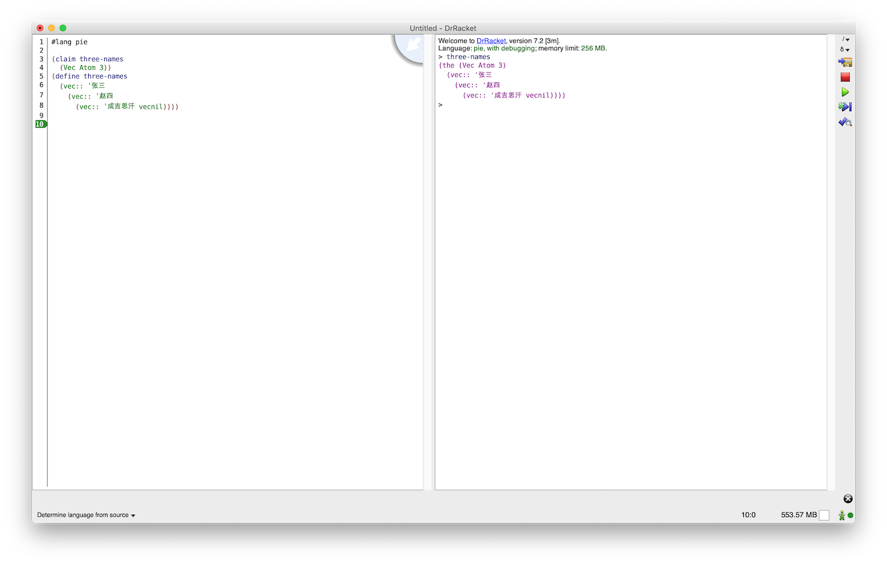

再有就是可以打开 DrRacket 的 Preferences 界面（⌘-, 或 Ctrl-,），将 Background expansion 设置成 "with gold highlighting"：


这样就可以更容易地定位到程序中有问题的部分：

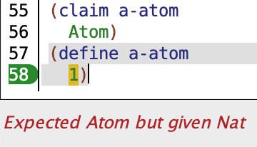

### Pie 语言简介

Pie 的语法类似于 Lisp 的各种方言（Scheme，Racket 和 Clojure 等），也就意味着程序中括号的数量会比较可观。在 Pie 语言里，每个变量或函数在定义前都必须声明类型：

```pie
(claim age
  Nat)
(define age
  18)
```

这里是先声明变量`age`的类型为自然数`Nat`，再把它的值定义为`18`。Pie 的几个基础类型分别是，

- 自然数`Nat`。表示所有大于等于 0 的整数。
- 原子`Atom`。相当于 Lisp 中的 symbol 类型，或者也可以粗略的近似于大部分语言里的字符串。`Atom`的值由单撇号和一个或多个字母或连字符组成，例如`'abc`，`'---`和`'Atom`。
- 函数`(-> Type-1 Type-2 ... Type-n)`。这里最后的`Type-n`是函数的返回值类型，其他的`Type-1 Type-2 ...`是参数类型。
- 全集`U`。因为在 Pie 里所有的类型可以像值一样被计算和传递，所以它们本身也需要一个类型，这个类型就是`U`。`U`是除自身外所有类型的类型。

还有一些复合类型会在后面用到的时候再作详细解释。Pie 的每个类型都有对应的 constructor 和 eliminator。前者用来构造该类型的值；后者的用处是**运用该类型的值所包含的信息来得到所需要的新值**，如果把某种类型的值看作一个罐头的话，那它对应的 eliminator 就像一个起子，而且不同构造的罐头需要用到不一样的起子。

#### 函数

函数的 constructor 拥有如下结构：

```pie
(lambda (x1 x2 ...)
  e1 e2 ...)
```

`x1 x2 ...`是函数的参数，`e1 e2 ...`是作为函数体的一个或多个表达式，函数体的最后一个表达式的值同时也是函数的返回值。另外`lambda`关键字也可以用希腊字母`λ`来代替 [^3]，让程序看起来更简洁。下面是一个完整的函数定义示例：

```pie
(claim echo
  (-> Atom
    Atom))
(define echo
  (λ (any-atom)
    any-atom))
```

这里先是声名这个函数的类型：接受一个`Atom`类型的值作为参数，然后返回一个`Atom`类型的值。接着就是函数`echo`的具体定义：无论传入什么`Atom`都原样返回。对于函数来说 eliminator 只有一个，那就是对函数的调用，只能借由这唯一的途径来使用定义好的函数。函数的调用语法是，`(函数名或匿名函数 参数1 参数2 ...)`：

```pie
> (echo '你好)
(the Atom '你好)
```

以`>`开头的一行表示这是在交互区输入的内容，下面紧跟着的是这行运行后得到的值。`'你好`前面的`the Atom`是对这个值的类型注解。对于在交互区输入的表达式，Pie 都会以 (the 类型 值) 的形式来显示它的值：

```pie
> 18
(the Nat 18)
```

另外，(the 类型 ...) 表达式也可以用来在解释器无法判断当前表达式的类型的情况下给予解释器一个提示：
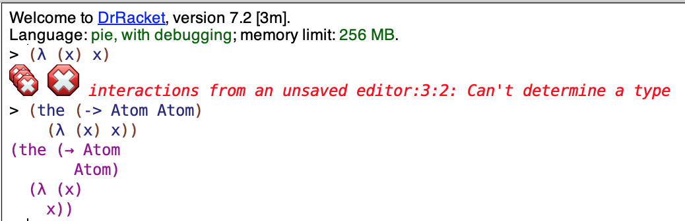

#### Atom

对于`Atom`来说所有符合规则的值都是一个 constructor，而且`Atom`没有对应的 eliminator，因为每个值本身就是它的意义所在。

#### Nat

自然数`Nat`的 constructor 是`zero`和`add1`。`zero`顾名思义得到的是最小自然数零，而`add1`接受一个自然数`n`作为参数，得到一个比`n`大`1`的自然数。所以自然数 1、2、3 可以分别表示成`(add1 zero)`、`(add1 (add1 zero))`、`(add1 (add1 (add1 zero)))`。如果用归纳法来定义`Nat`的话，可以写作：

```code
Nat ::= zero
Nat ::= (add1 Nat)
```

用这种方式定义出来的自然数又叫做[皮亚诺数（Peano number）](https://wiki.haskell.org/Peano_numbers)。当然这种表示方式写起来有些繁琐，所以 Pie 也提供了更便捷的语法：可以直接把自然数写作数字，例如`zero`和`0`、`(add1 (add1 zero))`和`2`都是等价的。对于自然数， Pie 提供了多个可供使用的 eliminator。具体使用哪个取决于要解决的问题。比如定义一个类型为`(-> Nat Nat)`的函数`pred`，规定它对于自然数`0`返回`0`，对于其他自然数返回比自身小一的数：

```pie
(claim pred
  (-> Nat
    Nat))
(define pred
  (λ (n)
    (which-Nat n
      0
      (λ (n-1)
        n-1))))
```

函数`pred`用到的 eliminator 是 [which-Nat](https://docs.racket-lang.org/pie/index.html#%28def._%28%28lib._pie%2Fmain..rkt%29._which-.Nat%29%29)。`which-Nat`的使用方式是`(which-Nat target base step)`，它的值由`target`、`base`和`step`三个参数决定。如果用`X`指代`which-Nat`的返回值类型，那么`target`的类型是`Nat`，`base`的类型是`X`，而`step`是一个类型为`(-> Nat X)`的函数。
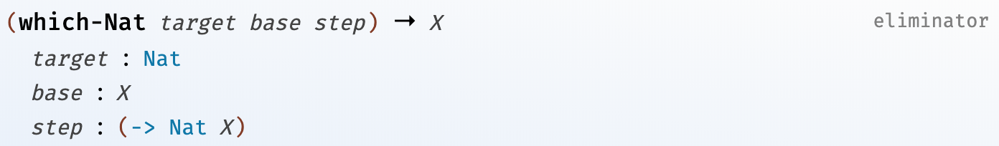
当`target`等于`0`时，`base`的值即为整个`which-Nat`表达式的值；如果`target`不为`0`或者说`target`可以表示成形如`(add1 n-1)`的自然数（这里的`n-1`是一个普通的标识符，不是`n`减`1`的表达式），这时`which-Nat`的值等于`step`函数作用于`n-1`（即比`target`小`1`的自然数）所得到的值。

在上述函数`pred`中，`which-Nat`的`target`是`pred`的参数`n`，`base`是`0`，`step`是函数`(λ (n-1) n-1)`。所以当`n`等于`0`时，`which-Nat`返回`base`的值，`0`；当`n`大于`0`或者说`n`等于`(add1 n-1)`时，`which-Nat`返回的就是`(step n-1)`的值，即参数`n-1`本身。

```pie
> (pred 10086)
(the Nat 10085)
> (pred 0)
(the Nat 0)
```

如果熟悉所谓的函数式语言，可以看出来`which-Nat`其实就是这些语言里的 pattern matching（虽然并不完全等同，后边会说到区别）。如果用 Idris 实现`pred`的话，会是这个样子：

```idris
pred : Nat -> Nat
pred Z = Z
pred (S k) = k
```

在 Idris 里，`Z`和`S`分别是`Nat`类型的两个 constructor，等同于 Pie 里的`zero`和`add1`。后两行的两个 pattern matching 的分支也对应于`which-Nat`的`base`和`step`。前面说到的`which-Nat`和 pattern matching 的区别指的是，在常规的 pattern matching 中可以对函数递归调用，而 Pie 并不允许用户定义的函数对自身的递归调用，这个限制的目的是为了保证所有的函数都是 [**total**](https://en.wikipedia.org/wiki/Partial_function#Total_function) 的。举实现自然数加法运算的函数为例，在支持递归调用的语言比如 Idris 中可以这样实现（递归在最后一行）：

```idris
plus : Nat -> Nat -> Nat
plus Z m = m
plus (S k) m = S (plus k m)
```

如果 Pie 允许函数的递归调用，完全可以用`which-Nat`实现同样的逻辑：

```pie
(claim +
  (-> Nat Nat
    Nat))
(define +
  (λ (n m)
    (which-Nat n
      m
      (λ (n-1)
        (add1 (+ n-1 m)))))) ; 错误: Unknown variable +
```

不幸的是如果把上面这段程序输入到定义区域，DrRacket 会在最后一行提示 “Unknown variable +”。所以我们只能改成使用“内置了递归”的 eliminator，[rec-Nat](https://docs.racket-lang.org/pie/index.html#%28def._%28%28lib._pie%2Fmain..rkt%29._rec-.Nat%29%29)。`rec-Nat`和`which-Nat`类似，接受的三个参数也是`target`、`base`和`step`，而且当`target`等于`0`时同样把`base`作为自身的值返回。
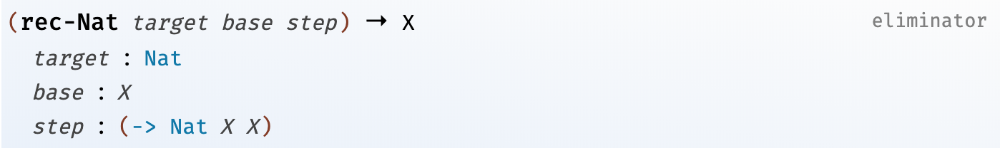
不同的是`rec-Nat`的`step`参数类型是`(-> Nat X X)`。当`target`可以表示成`(add1 n-1)`的非零自然数时，`step`的两个参数分别是`n-1`和`(rec-Nat n-1 base step)`。也就是说`rec-Nat`内置了对自身的递归调用，作为`rec-Nat`的使用者只需要知道`step`的**第一个参数是比当前的非零`target`小一的自然数，第二个参数等于把第一个参数作为新的`target`传递给递归的`rec-Nat`所得到的值**。

用`rec-Nat`来实现`+`函数同样可以把`n`作为`target`，`n`等于`0`时`base`的值应该为`m`，因为`(+ 0 m)`等于`m`：

```pie
(claim +
  (-> Nat Nat
    Nat))
(define +
  (λ (n m)
    (rec-Nat n
      m
      TODO)))
```

因为还没有决定`step`如何实现，可以在它的位置上暂时写上`TODO`。在 Pie 里可以用`TODO`替代程序中尚未实现的部分，Pie 还可以提示每个`TODO`应该是什么类型。如果运行上面的程序片段，会得到和`TODO`相关的信息：

```code
 n : Nat
 m : Nat
------------
 (→ Nat Nat
   Nat)
```

横线上面的`n`和`m`是当前`TODO`所在的 scope 里所有的变量类型，下面是它本身的类型。从`rec-Nat`的定义可以知道`TODO`代表的`step`函数接受的第一个参数是比`n`小一的自然数（因为`n`是`target`），可以取名为`n-1`；另一个参数是把`n-1`作为新的`target`时递归调用`rec-Nat`的结果，其实也就是`n-1`与`m`的和，所以可以取名`n-1+m`：

```pie
(define +
  (λ (n m)
    (rec-Nat n
      m
      (λ (n-1 n-1+m)
        TODO))))
```

此时`TODO`的类型变为了：

```code
     n : Nat
     m : Nat
   n-1 : Nat
 n-1+m : Nat
-------------
 Nat
 ```

从这个类型描述可以知道`step`函数体必须是一个值类型为`Nat`的表达式，这个表达式的值也是最终的结果，`n`与`m`的和。现在我们已经有了`n-1`与`m`的和，想得到`n`加`m`的话当然就是把`n-1+m`参数加一：

```pie
(define +
  (λ (n m)
    (rec-Nat n
      m
      (λ (n-1 n-1+m)
        (add1 n-1+m)))))
```

这样就得到了完整的`+`函数的定义。为了加深对`rec-Nat`的理解，我们可以模拟一下解释器对`(+ 2 1)`的求值过程。当解释器遇到表达式`(+ 2 1)`时，首先会判断这是一个函数调用，所以第一步把函数名替换成实际的函数定义：

```pie
((λ (n m)
    (rec-Nat n
      m
      (λ (n-1 n-1+m)
        (add1 n-1+m))))
 2 1)
```

然后将函数体中的`n`和`m`分别替换成`2`和`1`：

```pie
(rec-Nat 2
  1
  (λ (n-1 n-1+m)
    (add1 n-1+m)))
```

因为`target`等于非零自然数`2`，也就是`(add1 1)`，所以`rec-Nat`的值就等于对`step`函数调用后的值（将`step`的函数体`(add1 n-1+m)`中的`n-1+m`替换成对`rec-Nat`的递归调用）：

```pie
(add1
  (rec-Nat 1
    1
    (λ (n-1 n-1+m)
      (add1 n-1+m))))
```

这时内层的`rec-Nat`的`target`参数等于`(add1 zero)`仍然不为零，所以继续将`rec-Nat`表达式替换成调用`step`所得到的值：

```pie
(add1
  (add1
    (rec-Nat 0
      1
      (λ (n-1 n-1+m)
        (add1 n-1+m)))))
```

现在最里层的`rec-Nat`的`target`等于`0`，所以它的值就等于`base`的值`1`:

```pie
(add1
  (add1
    1))
```

这样就得到了最后的结果`3`。

#### 柯里化

虽然前面介绍函数时说函数是可以接受多个参数的（`(lambda (x1 x2 ...) e1 e2 ...)`），但其实本质上 Pie 的函数只接受一个参数。之所以可以定义出接受多个参数的函数，是因为 Pie 的解释器会对函数作一个叫做 [柯里化（currying）](https://en.wikipedia.org/wiki/Currying) 的处理。比如这四个函数：

```pie
;; 接受两个 Atom 参数，返回值类型为 Atom
;; 声明类型和函数定义的形式一致
(claim currying-test1
  (-> Atom Atom
    Atom))
(define currying-test1
  (λ (a b)
    b))

;; 声明类型同上
;; 声明类型和函数定义的形式不一致
(claim currying-test2
  (-> Atom Atom
    Atom))
(define currying-test2
  (λ (a)
    (λ (b)
      b)))

;; 接受一个 Atom 参数，返回一个类型为 (-> Atom Atom) 的函数
;; 声明类型和函数定义的形式不一致
(claim currying-test3
  (-> Atom
    (-> Atom
      Atom)))
(define currying-test3
  (λ (a b)
    b))

;; 声明类型同上
;; 声明类型和函数定义的形式一致
(claim currying-test4
  (-> Atom
    (-> Atom
      Atom)))
(define currying-test4
  (λ (a)
    (λ (b)
      b)))
```

这几个函数无论是否有声明类型上的差异，还是声明和定义形式是否一致，在 Pie 的解释器看来都是完全相同的：

```pie
> currying-test1
(the (→ Atom Atom
       Atom)
  (λ (a b)
    b))

> currying-test2
(the (→ Atom Atom
       Atom)
  (λ (a b)
    b))

> currying-test3
(the (→ Atom Atom
       Atom)
  (λ (a b)
    b))

> currying-test4
(the (→ Atom Atom
       Atom)
  (λ (a b)
    b))
```

知道了这一点我们就可以运用所谓的 [partial application](https://en.wikipedia.org/wiki/Partial_application) 从已有的函数生成出其他“固定”了某些参数的值的新函数。比如可以从前述的加法函数`+`得到把参数加一的新函数：

```pie
(claim plus-one
  (-> Nat
    Nat))
(define plus-one
  (+ 1))

> (plus-one 2)
(the Nat 3)
```

用了比较长的篇幅来介绍 Pie 的几个基础类型，接下来可以说一说 Pie 语言里的几种依赖类型了。

### 依赖于类型的类型：List

如果熟悉 Java 的泛型（generics）或者 ML 的多态（polymorphism）的话，应该会很容易理解 Pie 的 [List](https://docs.racket-lang.org/pie/index.html#%28part._.Lists%29) 类型。在 Pie 中，若`E`是一个类型则`(List E)`是一个 List 类型，代表一类元素类型都是`E`的 List。`(List Nat)`、`(List (-> Nat Atom))`和`(List (List Atom))`都是 List 类型，但是`(List 1)`和`(List '你好)`不是合法的类型。

List 有两个 constructor：`nil`和`::` [^4]。`nil`构造一个空 List；`::`接受两个参数`e`、`es`，如果`e`和`es`的类型分别为`E`和`(List E)`，则`(:: e es)`构造的是类型为`(List E)`比`es`多一个元素`e`的 List。List 类型可以用归纳法描述如下：

```code
(List E) ::= nil
(List E) ::= (:: E (List E))
```

可以看出来 List 的 constructor 和`Nat`的很相似：`nil`对应于`zero`，`::`对应于`add1`。下面是构造一个`(List Atom)`的示例：

```pie
(claim philosophers
  (List Atom))
(define philosophers
  (:: 'Descartes
    (:: 'Hume
      (:: 'Kant nil))))
```

要使用或者处理 List 类型的值，同样也需要对应的 eliminator。List 版的“内置”了递归的 eliminator 叫 [rec-List](https://docs.racket-lang.org/pie/index.html#%28def._%28%28lib._pie%2Fmain..rkt%29._rec-.List%29%29)，它也遵循相同的使用模式，即`(rec-List target base step)`：
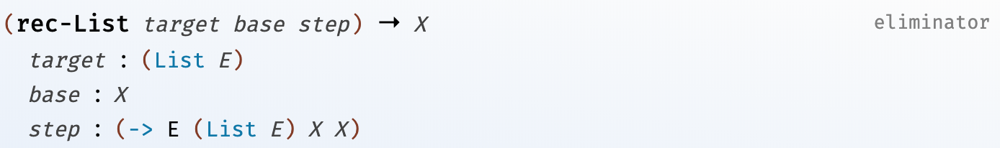
类似地，当`target`为`nil`时，`base`的值就作为整个表达式的值；当`target`不为`nil`而可以写作`(:: e es)`时，`step`的返回值则作为整个表达式的最终结果，此时`step`的三个参数分别是`e`、`es`和`(rec-List es base step)`。继续通过一个例子来详细说明`rec-List`的用法，写一个返回 List 长度的函数`length`。如果想把`length`定义成可以作用于元素类型任意的 List（`(List Nat)`、`(List Atom)`等），进而将其声明如下的话，

```pie
(claim length
  (-> (List E) ; 错误: Not a type
    Nat))
```

解释器会在第二行提示“Not a type”的错误，因为在它看来`E`没有被声明过是一个未知的变量，所以`(List E)`也就不是一个合法的类型。所以我们需要一个新表达式用来在类型声明中引入变量，这个表达式叫作`Pi`（在程序中也可以用希腊字母`Π`[^5] 代替）。`length`的新的类型声明如下：

```pie
(claim length
  (Π ((E U))
    (-> (List E)
      Nat)))
```

`Pi`表达式的第一个列表里可以写多个类型变量`(Π ((x X) (y Y) ...) ...)`，其中`x`、`y`是变量名，`X`和`Y`是变量的类型。`length`的类型声明里只需要一个变量`E`，因为`E`是 List 里元素的类型，所以`E`的类型是`U`。如果类比 Java 的泛型，

```java
<E> int length(List<E> lst) {...}
```

可能会觉得`Pi`表达式也只是实现了类似的功能，但其实`Pi`可以做的更多。开头介绍的箭头型的函数类型只是`Pi`表达式的一个简写形式，所以`Pi`本质上声明的是一个函数，意味着列表里可以放入任何类型的变量。比如

```pie
(claim fun1
  (-> Atom Nat
    Atom))
```

也可以写成

```pie
(claim fun1
  (Π ((a Atom)
      (n Nat))
    Atom))
```

只不过这里变量`a`和`n`没有在后面的类型声明里用到，所以写作箭头型的就足够。下面是用了`Pi`表达式后，完整的`length`定义：

```pie
(claim length
  (Π ((E U))
    (-> (List E)
      Nat)))
(define length
  (λ (E lst)
    (rec-List lst
      0
      (λ (e es length-es)
        (add1 length-es)))))
```

`Π`和箭头表达式组合在一起声明了一个接受两个参数返回一个`Nat`的函数，定义中对应的两个参数一个是类型为`U`的参数`E`，另一个是类型为`(List E)`的参数`lst`。函数体中只用到了第二个参数`lst`，把它作为`target`传给`rec-List`表达式。当`lst`为`nil`时长度为`0`；若`lst`可以表示为`(:: e es)`形式的非空 List，则`step`函数的第三个参数是表达式`(rec-List es 0 step)`的值，因为这个值其实就是`es`的长度，所以起名叫`length-es`。又因为`es`比`lst`少一个元素`e`，所以`lst`长度等于`es`的长度加一，即`(add1 length-es)`。

有了`length`就可以得到任意 List 的长度了：

```pie
> (length Atom philosophers)
(the Nat 3)

> (length Nat
    (:: 1 (:: 2 (:: 3 (:: 4 nil)))))
(the Nat 4)
```

类似的也可以通过`rec-List`定义合并 List 的函数`append`：

```pie
(claim append
  (Π ((E U))
    (-> (List E)
        (List E)
      (List E))))
(define append
  (λ (E)
    (λ (start end)
      (rec-List start
        end
        (λ (e es append-es)
          (:: e append-es))))))

(claim existentialists
  (List Atom))
(define existentialists
  (:: 'Kierkegaard
    (:: 'Sartre
      (:: 'Camus nil))))

> (append Atom philosophers existentialists)
(the (List Atom)
  (:: 'Descartes
    (:: 'Hume
      (:: 'Kant
        (:: 'Kierkegaard
          (:: 'Sartre
            (:: 'Camus nil)))))))
```

假设我们没能正确地实现`append`，比如错误地定义了`step`：

```pie
(claim append-wrong
  (Π ((E U))
    (-> (List E)
        (List E)
      (List E))))
(define append-wrong
  (λ (E)
    (λ (start end)
      (rec-List start
        end
        (λ (e es append-es)
          append-es))))) ;; 错误地忽略了 e
```

解释器仍然会接受这个函数定义，因为从类型系统的角度来看`append-wrong`仍然是“正确”的，它确实返回了类型是`(List E)`的值，即使这个值不是我们所预期的：

```pie
> (append-wrong Atom philosophers existentialists)
(the (List Atom)
  (:: 'Kierkegaard
    (:: 'Sartre
      (:: 'Camus nil))))
```

如果想让解释器帮助我们判断程序是否正确，只能通过某种形式的“测试”来实现：

```pie
(check-same Nat
  (length Atom
    (append-wrong Atom philosophers existentialists))
  (+ (length Atom philosophers)
     (length Atom existentialists)))
```

这里我们通过`append`函数应有的一个属性—— append 后得到的 List 的长度等于两个参数 List 长度的和——来检验函数的正确性。`check-same`表达式的使用方式是`(check-same type expr1 expr2)`，如果`expr1`和`expr2`不是两个相等的`type`类型的值，解释器会“静态”地指出这个错误：
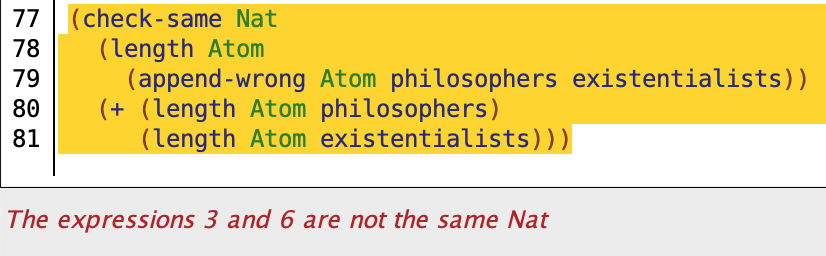

下面要介绍的这个新类型可以说是有长度属性的 List，和这个新类型相关的函数都可以借助参数和返回值的类型来自动实现类似于上面程序片段中的对于长度属性的检查。

### 依赖于值的类型：Vec

文章开头假想的那个 Java 的有长度属性的数组类型其实就是对 Vec 类型的模仿。Vec 类型写作`(Vec E len)`，其中`E`和 List 类型中的一样，是一个类型为`U`的值，代表所有元素的类型；而`len`是一个`Nat`类型的值，代表 Vec 的长度。所以开头的`three-names`可以声明为：

```pie
(claim three-names
  (Vec Atom 3))
```

Vec 的 constructor 和 List 的非常相似，分别是`vecnil`和`vec::`，对应于 List 的`nil`和`::`。这样`three-names`可以定义为：

```pie
(define three-names
  (vec:: '张三
    (vec:: '赵四
      (vec:: '成吉思汗 vecnill))))
```

如果不小心多写了一个`vec::`，则声明的类型和实际定义的不一致，解释器就会指出这个错误，虽然错误描述不是很明确：
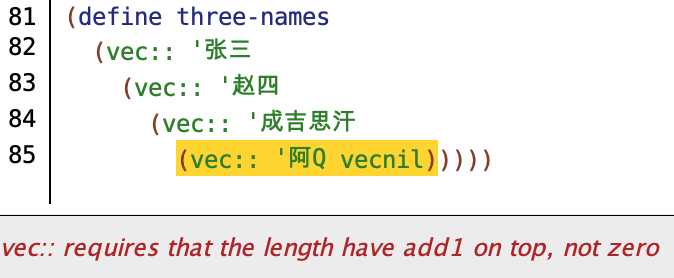

在深入讨论 Vec 类型前需要再介绍另一个`Nat`类型的 eliminator，因为它与 Vec 类型有着非常密切的关系。仍然是通过一个例子来说明，假设定义一个函数`repeat`，它可以重复`count`次某个任意类型`E`的值`e`，返回的结果是一个长度为`count`、元素类型`E`且所有元素都是`e`的 Vec。这个函数声明如下：

```pie
(claim repeat
  (Π ((E U)
      (count Nat))
    (-> E
      (Vec E count))))
```

因为类型`E`和次数`count`在后面的类型声明中都会用到，所以被放在了`Π`表达式的参数列表里。表达式`(-> E (Vec E count))`指的是一个接受一个类型为`E`的值作为参数，返回一个`(Vec E count)`的函数。假设我们用已有的`rec-Nat`来实现的话，大概会这样写：

```pie
;; 一次失败的尝试😢
(define repeat
  (λ (E count)
    (λ (e)
      (rec-Nat count
        vecnil
        (λ (c-1 repeat-c-1)
          (vec:: e repeat-c-1))))))
```

但是问题是`rec-Nat`要求`base`、`step`以及整个`rec-Nat`表达式的值的类型必须一致，在上述定义中，`repeat`的声明类型即整个`rec-Nat`表达式的类型是`(Vec E count)`；`base`是类型为`(Vec E 0)`的`vecnil`；而`step`每次递归调用所返回的类型都不一样，在`target`从`1`到`count`变化的过程中，返回值也从`(Vec E 1)`变到`(Vec E count)`。所以解释器不会接受这个函数定义。

#### 更强大的归纳式 eliminator

像 Vec 这样接受参数的类型在类型理论里被叫做 type family，随着传入的参数的不同，得到的类型也在变化。所以上例中的`(Vec E 0)`、`(Vec E 1)`…… 在类型系统看来都是不同的类型。而类似于`E`这样不变的参数被称作 **parameter**，像`0`、`1`…… 这样变化着的参数被叫做 **index** [^6]。在 Pie 语言里处理包含不同 index 的一类类型时，需要用到的一类 eliminator 都以 ind- 开头（ind 是 inductive 的缩写）。在`repeat`函数中，因为 target 是`Nat`类型的，所以用到的 eliminator 是 [ind-Nat](https://docs.racket-lang.org/pie/index.html#%28def._%28%28lib._pie%2Fmain..rkt%29._ind-.Nat%29%29)。`ind-Nat`除了接受和`rec-Nat`类似的`target`、`base`和`step`三个参数外，还需要一个额外的参数`motive`[^7]。
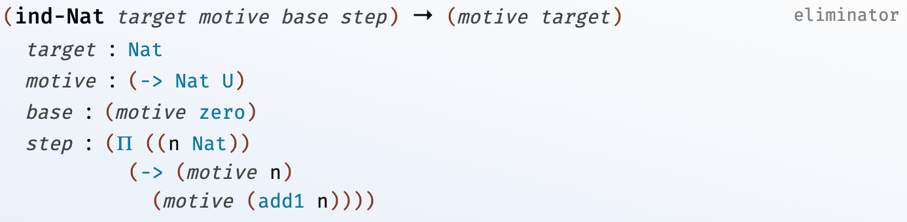
`motive`的类型是`(-> Nat U)`，它根据传入的自然数参数返回一个对应的**类型**。在`ind-Nat`中，`target`的类型仍然为`Nat`；`base`的类型变成了`(motive zero)`，也就是函数`motive`作用于自然数`zero`时返回的类型；整个`ind-Nat`表达式的值的类型是`(motive target)`；而`step`的类型要更复杂一些：

```pie
(Π ((n Nat))
  (-> (motive n)
    (motive (add1 n))))
```

它接受两个类型分别为`Nat`和`(motive n)`的参数，返回一个类型为`(motive (add1 n))`的值。`step`的第一个参数是比当前`target`小一的自然数`n`，第二个是把`n`作为新的`target`递归调用`ind-Nat`——`(ind-Nat n motive base step)`——后得到的值。因为`(add1 n)`等于当前的`target`，所以`step`的返回值类型`(motive (add1 n))`和整个`ind-Nat`表达式值的类型`(motive target)`也是相同的。现在可以着手用`ind-Nat`来实现`repeat`函数了。首先将`count`参数作为`target`传递给`ind-Nat`：

```pie
(claim repeat
  (Π ((E U)
      (count Nat))
    (-> E
      (Vec E count))))
(define repeat
  (λ (E count)
    (λ (e)
      (ind-Nat count    ; count 作为 target
        TODO
        TODO
        TODO))))
```

接下来确定比较简单的`base`的值，当`count`为`0`时，`repeat`应该返回一个长度为`0`的`(Vec E 0)`，这样的 Vec 只有一个，就是`vecnil`：

```pie
(define repeat
  (λ (E count)
    (λ (e)
      (ind-Nat count
        TODO
        vecnil          ; 类型为 (Vec E 0) 的 vecnil 作为 base
        TODO))))
```

又因为`base`的类型其实是由`motive`函数决定的，即`(motive 0)`。所以从`base`的类型可以反推出`motive`应该是一个接受一个自然数`k`作为参数，返回类型`(Vec E k)`的函数。这里需要注意`motive`**返回的是类型`(Vec E k)`，而不是类型为`(Vec E k)`的值**，换句话说`motive`返回的是类型为`U`的值`(Vec E k)`。

```pie
(define repeat
  (λ (E count)
    (λ (e)
      (ind-Nat count
        (λ (k)          ; motive 函数
          (Vec E k))    ; 返回的是类型
        vecnil
        TODO))))
```

有了`motive`之后，就可以知道`step`的类型了：

```pie
(Π ((c-1 Nat))            ; c-1 代表比 count 小一的自然数
  (-> (Vec E c-1)         ; 即 (motive c-1)
    (Vec E (add1 c-1))))  ; 即 (motive (add1 c-1))
```

根据类型就可以确定`step`的函数定义中需要接受两个参数：

```pie
(define repeat
  (λ (E count)
    (λ (e)
      (ind-Nat count
        (λ (k)
          (Vec E k))
        vecnil
        (λ (c-1 repeat-c-1)
          TODO)))))
```

`repeat-c-1`参数代表的是把`count`减一后得到的自然数`c-1`作为新的`target`去递归调用`ind-Nat`所得到的类型为`(Vec E c-1)`的值。这个值比`repeat`要返回的`(Vec E (add1 c-1))`长度少一，又因为返回的 Vec 的所有元素都是`e`（`repeat`的参数之一），所以只要把`e`放到`repeat-c-1`里就得到了最终的结果：

```pie
(define repeat
  (λ (E count)
    (λ (e)
      (ind-Nat count
        (λ (k)
          (Vec E k))
        vecnil
        (λ (c-1 repeat-c-1)
          (vec:: e repeat-c-1))))))
```

Vec 类型中既有元素的类型信息，也包含了长度信息，相比于 List 来说，Vec 使得类型系统能发现更多的程序错误。如果在上面`repeat`函数定义的第 9 行犯了类似前面`append-wrong`的错误，忘记了插入`e`的话，类型系统会有一个错误提示：
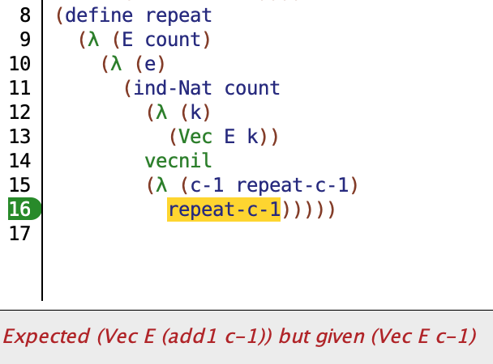

所以当一个处理 Vec 类型的函数通过了类型系统检查的时候，我们就会对它的正确性有更多的信心。

通过`repeat`这个例子也可以看出来`ind-Nat`的用法和思路与`rec-Nat`非常接近，区别只在于`rec-Nat`中的`base`、`step`的第二个参数以及`step`的返回值的类型都是一样的，这个类型也是整个`rec-Nat`表达式值的类型；而对于`ind-Nat`来说，这三者的类型可能相同也可能不同，具体是什么类型取决于`motive`函数分别作用于`zero`、比`target`小一的自然数以及`target`本身时所得到的类型。从这一点也可以看出`rec-Nat`其实是更通用的`ind-Nat`的一个特例，所以可以用`ind-Nat`来实现`rec-Nat`：

```pie
(claim my-rec-Nat
  (Π ((E U))
    (-> Nat         ; target 的类型
        E           ; base 的类型
        (-> Nat     ; step 的第一个参数的类型
            E       ; step 的第二个参数的类型
          E)        ; step 的返回值类型
      E)))          ; my-rec-Nat 的返回值类型
(define my-rec-Nat
  (λ (E)
    (λ (target base step)
      (ind-Nat target
        (λ (k) E)   ; 这里的 motive 决定了 base、step 的参数
        base        ; 和返回值类型都是 E
        step))))
```

归纳式 eliminator 之所以被这样称呼是因为它们包含了和数学中归纳式证明相类似的想法。如果要证明一个关于自然数的定理，首先证明 x = 0 的情况成立，然后假设 x = n - 1 时定理成立，如果可以从这个假设推出 x = n 时定理也成立，那么就可以肯定这个定理在自然数范围内都成立。同样的，如果我们告诉`ind-Nat`当`target`等于`zero`时表达式的值，以及当`target`等于`(add1 n)`时，如何从`n`所对应的结果得到`(add1 n)`所对应的结果，那么`ind-Nat`就可以得到所有自然数范围内的参数所对应的表达式的值，只不过首先需要通过`motive`参数指出任意一个`Nat`所对应的类型。Pie 语言中所有以 ind- 开头的 eliminator 都包含同样的思想，区别只在于`target`和`step`参数的类型。接下来再分别看一下 List 和 Vec 的归纳式 eliminator。

#### List 和 Vec 的归纳式 eliminator

List 类型的（毫无悬念地）叫作 [ind-List](https://docs.racket-lang.org/pie/index.html#%28def._%28%28lib._pie%2Fmain..rkt%29._ind-.List%29%29)。
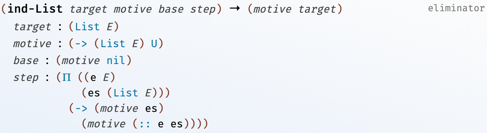
它的用法和`ind-Nat`非常接近，只是`motive`的参数类型从`Nat`换成了`(List E)`，`step`的三个参数的语义和`rec-List`的也是相同的（除了第三个参数的类型变为由`motive`决定这一点）。有了`ind-List`就可以实现一些接受 List 类型参数，返回 Vec 类型值的函数，例如把 List 转换成等同的 Vec 的函数`list->vec`。这里“等同”指的是转换前后的长度相等，而且所有元素相同、顺序不变。先来写出函数的声明：

```pie
(claim list->vec
  (Π ((E U)
      (lst (List E)))
    (Vec E (length E lst))))
```

首先`list->vec`需要一个`(List E)`类型的参数，所以在这个参数之前要有一个类型为`U`的变量`E`，另外返回值类型中也会用到 List 类型的参数，这样就把`lst`参数也作为类型变量放到`Π`表达式的括号内。返回值类型中包含的表达式`(length E lst)`是用来表达转换前后长度相同的语义，这里的`length`是上文中实现的计算 List 长度的函数。下面是函数`list->vec`的实现：

```pie
(define list->vec
  (λ (E lst)
    (ind-List lst
      (λ (xs)                   ; motive 返回与 List 类型的参数 xs
        (Vec E (length E xs)))  ; 长度相同的 Vec 类型
      vecnil                    ; base 的类型为 (motive nil)，即 (Vec E 0)，只能是 vecnil
      (λ (e es list->vec-es)    ; list->vec-es 是参数 es 被转换后的结果
        (vec:: e list->vec-es)))))
```

和使用`ind-Nat`时运用的归纳式思想一样，在使用`ind-List`的时候需要，

1. 通过`motive`定义如何从`(List E)`得到所需的类型，这里`motive`的参数`xs`对应一个元素类型为`E`，长度与`xs`相等的 Vec；
2. 通过`base`参数指出当`target`等于`nil`时整个`ind-List`表达式的值，`nil`的长度为`0`，所以对应的 Vec 就是`vecnil`；
3. 通过`step`函数告诉解释器，当`target`等于`(:: e es)`时如何从`es`对应的结果，也就是`es`所转换成为的`list->vec-es`，来得到`(:: e es)`所要转换成为的那个 Vec，可以很容易的知道就是`(vec:: e list->vec-es)`。

这样最终得到的就是一个可以把任意 List 转换成等价的 Vec 的函数。

```pie
> (list->vec Atom philosophers)
(the (Vec Atom 3)
  (vec:: 'Descartes
    (vec:: 'Hume
      (vec:: 'Kant vecnil))))
```

在前面`repeat`的例子里展示过，Vec 类型使得类型系统可以在程序运行前就检测出导致长度不一致的一类错误。但是仍然有可能写出长度和类型都正确而实际值却不是所预期的错误程序。比如下面这个只是重复第一个元素的错误版`list->vec`：

```pie
(claim list->vec-wrong
  (Π ((E U)
      (lst (List E)))
    (Vec E (length E lst))))
(define list->vec-wrong
  (λ (E lst)
    (ind-List lst
      (λ (xs)
        (Vec E (length E xs)))
      vecnil
      (λ (e es list->vec-es)
        (repeat E (length E (:: e es)) e)))))


> (list->vec-wrong Atom philosophers)
(the (Vec Atom 3)
  (vec:: 'Descartes
    (vec:: 'Descartes
      (vec:: 'Descartes vecnil))))
```

类型系统没能检测出这个错误，程序运行的结果也不是预期的。那么怎样才能检测出这类错误呢？一个可行的办法是，我们可以写出`list->vec`的“逆运算”`vec->list`，继而就可以让这俩个函数互相检验对方的正确性。`vec->list`的声明部分写作：

```pie
(claim vec->list
  (Π ((E U)
      (l Nat))
    (-> (Vec E l)
      (List E))))
```

由于参数类型从 List 变成了 Vec，所以这个函数使用的是以 Vec 作为`target`的 eliminator，[ind-Vec](https://docs.racket-lang.org/pie/index.html#%28def._%28%28lib._pie%2Fmain..rkt%29._ind-.Vec%29%29)。
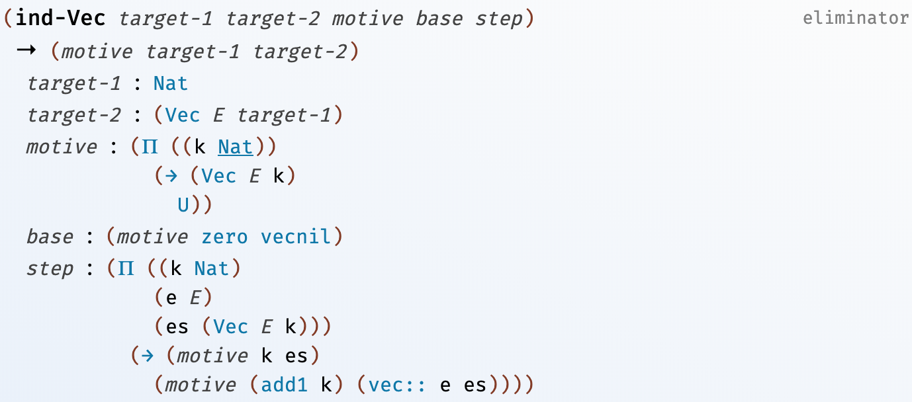
因为 Vec 类型多了一个长度属性，所以相应的，`ind-Vec`增加了一个`Nat`类型的 target-1 对应于 target-2 的长度，motive 函数也多了一个`Nat`类型的参数代表另一个参数的长度，最后 step 的`Nat`类型参数`k`也对应于`es`参数的长度。除了参数个数及类型的区别，`ind-Vec`的用法和`ind-List`基本一致。所以参照`list->vec`应该可以很容易地得到`vec->list`的定义：

```pie
(claim vec->list
  (Π ((E U)
      (l Nat))
    (-> (Vec E l)
      (List E))))
(define vec->list
  (λ (E l)
    (λ (vec)
      (ind-Vec l vec
        (λ (k xs)
          (List E))
        nil
        (λ (l-1 e es vec->list-es)
          (:: e vec->list-es))))))
```

有了`vec->list`之后要解决的问题是，如何用程序表达出“连续两次调用`list->vec`和`vec->list`仍然得到原先的 List”这个意思。我们现在知道的最接近这个需求的工具是`check-same`。比如下面检查的是对`(List Atom)`类型的`philosophers`接连应用`list->vec`和`vec-list`之后，内容不变：

```pie
(check-same (List Atom)
  philosophers
  (vec->list Atom 3
    (list->vec Atom  philosophers)))
```

不过这也只能验证对于`philosophers`来说，`list->vec`和`vec-list`两个函数是正确的。这个测试并不能保证这两个函数对于任何 List 或 Vec 都是正确的。这其实也是大多数语言中的单元测试所处的窘境，它们只能检验出某些错误的“存在”但是却没办法保证这类错误在任何情况下都“不存在”。有的测试工具也提供了一些方法来应对这个局限性，比如 [ScalaTest](http://www.scalatest.org/) 所提供的[基于属性的测试](http://www.scalatest.org/user_guide/property_based_testing)方法，指的是用一个函数来表达测试对象应该包含的目标属性，然后结合内置的 generator 来模拟对测试对象在整个作用域内的测试。下面就是对一个分数实现类`Fraction`在整个作用域（所有可能的被除数、除数对）内的一个测试：

```scala
class Fraction(n: Int, d: Int) {
  require(d != 0)
  require(d != Integer.MIN_VALUE)
  require(n != Integer.MIN_VALUE)

  val numer = if (d < 0) -1 * n else n
  val denom = d.abs

  override def toString = numer + " / " + denom
}

forAll { (n: Int, d: Int) =>
  whenever (d != 0 && d != Integer.MIN_VALUE
      && n != Integer.MIN_VALUE) {

    val f = new Fraction(n, d)

    if (n < 0 && d < 0 || n > 0 && d > 0)
      f.numer should be > 0
    else if (n != 0)
      f.numer should be < 0
    else
      f.numer should be === 0

    f.denom should be > 0
  }
}
```

不过这里用到的`forAll`并不是真的对所有可能的`n`、`d`组合来生成测试（不然测试程序会无限期的运行下去），只是尽可能多得生成一些范围内有代表性的实例。虽然这类工具能让测试更可靠，但是它们仍然没有带给开发者对程序正确性的绝对信心。本文开头提到过，像 Pie 之类的支持依赖类型的语言提供了一个在逻辑上证明程序某些属性成立与否的途径，有了它我们可以让程序变得更可靠了。

## 定理证明

为了说明这个证明的方法，需要从 Pie 语言里表达相等关系的类型说起。在 Pie 语言里，表示`x`等于`y`的类型写作`(= T x y)`，其中`T`是`x`和`y`的类型。例如`(= Nat (+ 1 1) 2)`表示表达式`(+ 1 1)`和`2`的值相等。所以`=`类型也是一个依赖于值的类型。

构造一个`=`类型的值时用到的 constructor 是`same`。如果表达式`e`的类型是`E`，那么`(same e)`就是类型为`(= E e e)`的值。前例中的`(= Nat (+ 1 1) 2)`类型的值可以写作`(same 2)`，因为解释器对`(+ 1 1)`的求值结果也是`2`。那么`(= Nat 3 4)`是不是一个合法的类型呢？答案是是的，但是我们没办法构造一个该类型的值：

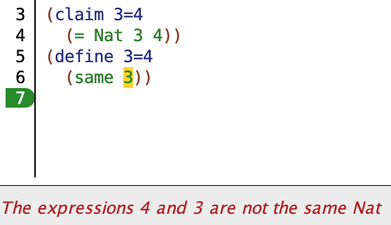

在定义中放入`(same 4)`也会得到类似的错误提示。如果套用传统编程语言对类型的定位来理解`=`类型的话，可能会觉得它有些怪异，因为`=`类型并不像前面的`Nat`或`Vec`类型，它看起来不像是一类值的集合。所以不如换一个角度来看待`=`类型，可以把它看作一个**陈述或命题**。这样就可以把`(= Nat (+ 1 1) 2)`读作“`(+ 1 1)`和`2`是两个相等的自然数”。这时`=`类型的**值**就变成它所代表的那个命题的一个**证明**。那么为什么`(same 2)`是`(= Nat (+ 1 1) 2)`的一个证明呢？这是因为我们举证出了一个值`2`，它既等于`(+ 1 1)`也等于`2`。同理，不存在`(= Nat 3 4)`类型的值也是因为我们没法找到一个可以证明`3`等于`4`的证据。像这种通过举证来证明的方法在数学中被叫作[构造式证明（Constructive Proof）](https://en.wikipedia.org/wiki/Constructive_proof)[^8]。

### 全称量词

有了这个看待类型的全新角度后，其实我们可以把任意类型都看作一个命题。比如`Atom`就是一个命题，而任何一个`Atom`类型的值都是它的证明，只不过这个命题的证明对我们来说没有多大的用处。而让我们感兴趣的是把`Π`表达式与`=`类型结合所得到的一类命题。因为`=`是依赖类型，所以可以放在`Π`表达式里，此时`Π`可以被看作是全称量词，整个表达式就变成了一个全称命题。比如下面这个声明：

```pie
(claim 1+=add1
  (Π ((n Nat))
    (= Nat (+ 1 n) (add1 n))))
```

可以把`1+=add1`的类型读作，“对于任意一个自然数`n`，`(+ 1 n)`与`(add1 n)`的值是两个相等的自然数”。这样声明的变量`1+=add1`代表的就是对命题的陈述。那么要如何证明这种全称命题？其实证明的过程也就是实现由`Π`表达式声明的函数的过程。

```pie
(define 1+=add1
  (λ (n)
    TODO))
```

这里`TODO`代表的是`=`类型的返回值，因为`=`类型的 constructor 只有`same`，所以`TODO`是一个`same`表达式，现在的问题是应该在`same`里放入什么样的既等于`(+ 1 n)`又等于`(add1 n)`的表达式。回忆一下`+`函数的定义：

```pie
(define +
  (λ (n m)
    (rec-Nat n
      m
      (λ (n-1 n-1+m)
        (add1 n-1+m)))))
```

可以看出来`(+ 1 n)`经过一次递归调用`rec-Nat`后可以简化成`(add1 n)`，所以应该用`(same (add1 n))`来替换`TODO`。其实如果看一下解释器输出的`TODO`类型提示，已经可以知道`same`里应该放入`(add1 n)`：

```code
c8.pie:28.4: TODO:
 n : Nat
-------------
 (= Nat
   (add1 n)
   (add1 n))
```

这样`1+=add1`的定义，或者说对`1+=add1`这个命题的证明最后就是这个样子：

```pie
(claim 1+=add1
  (Π ((n Nat))
    (= Nat (+ 1 n) (add1 n))))
(define 1+=add1
  (λ (n)
    (same (add1 n))))
```

这个命题声明中，表达式`(+ 1 n)`里并不是碰巧把`1`放在`n`的前面，故意这么写是为了让命题更容易证明。原因是`+`函数的定义中是把第一个参数作为了`rec-Nat`的 target，这样把`1`放在前面就可以使`rec-Nat`表达式直接简化成`(add1 n)`。如果反过来把`n`放在前面写成`(+ n 1)`的话，`(rec-Nat n ...)`没办法进一步简化（因为不知道未知参数`n`是否为零），这样`(same (add n))`也就不再是这个新命题的证明：
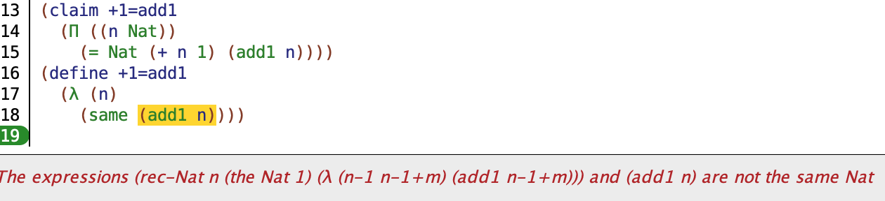

那么应该怎样来证明这个调换了`1`和`n`的位置后所得到的命题呢？前面曾经提过归纳式 eliminator（ind-Nat、ind-List 等）的用法和数学上的归纳式证明非常相似，而对于命题`+1=add1`我们就要真的用`ind-Nat`来进行归纳式证明了。对于所有的`ind-`eliminator 的使用第一步基本都是要写出 motive 函数，这里因为最终要得到是`(= Nat (+ n 1) (add1 n))`类型的值，如果把`n`作为`ind-Nat`的 target 的话，那我们需要的 motive 函数显然就是`(λ (k) (= Nat (+ k 1) (add1 k)))`，这样 base 的类型就是 motive 的参数`k`等于`0`时的返回值，`(= Nat (+ 0 1) (add1 0))`，简化得到`(= Nat 1 1)`，所以 base 的值就是`(same 1)`。包含了 motive 和 base 的定义如下：

```pie
(claim +1=add1
  (Π ((n Nat))
    (= Nat (+ n 1) (add1 n))))
(define +1=add1
  (λ (n)
    (ind-Nat n
      (λ (k)
        (= Nat (+ k 1) (add1 k)))
      (same 1)
      TODO)))
```

接下来需要写出 step 函数的定义。回忆一下`ind-Nat`中 step 的类型是：

```pie
(Π ((n-1 Nat))
  (-> (motive n-1)
    (motive (add1 n-1))))
```

其中的`n-1`是比 target 小一的数，把`motive`替换成写好的定义后得到的 step 的类型就是：

```pie
(Π ((n-1 Nat))
  (-> (= Nat (+ n-1 1) (add1 n-1))
    (= Nat (+ (add1 n-1) 1) (add1 (add1 n-1)))))
```

如果从求值的角度来看，step 的类型是说接受两个类型为`Nat`和`=`的参数得到另一个`=`类型的的值。不过我们还可以继续从定理证明的角度来解释这个类型，这时可以把`->`类型看作是一个“如果...那么...”的陈述句。这样整个类型就可以读作，“对于任意自然数`n-1`，如果`(+ n-1 1)`等于`(add1 n-1)`，那么`(+ (add1 n-1) 1)`也等于`(add1 (add1 n-1))`”，这其实就是数学上的归纳证明，所以对 step 函数的实现也是在完成归纳证明的第二步：从假设推导出要证明的结论。

另外要说的一点是返回值类型中的`(+ (add1 n-1) 1)`这一部分其实还可以进一步简化：根据`+`函数的定义可以把`add1`拿到最外层，变成`(add1 (+ n-1 1))`。为了更容易得实现 step，我们把它作为一个独立的函数来定义（返回值类型变成前述简化后的形式）：

```pie
(claim step-+1=add1
  (Π ((n-1 Nat))
    (-> (= Nat (+ n-1 1) (add1 n-1))
      (= Nat (add1 (+ n-1 1)) (add1 (add1 n-1))))))
(define step-+1=add1
  (λ (n-1 +1=add1-n-1)
    TODO))
```

接下来要解决的问题就是，怎样从类型为`(= Nat (+ n-1 1) (add1 n-1))`的`+1=add1-n-1`推导出`(= Nat (add1 (+ n-1 1)) (add1 (add1 n-1)))`这个命题。观察一下可以发现这两个`=`类型或者说命题的唯一区别是后边两个相等的表达式分别比前面的两个多了一个`add1`。所以这相当于在证明如果`(= Nat x y)`那么`(= Nat (add1 x) (add1 y))`，从直觉来判断这一定是成立的，如果两个自然数相等，那么各自加一后仍然相等。但是要如何在 Pie 语言里表达这样的等价关系？这里我们要用到的是`=`类型的其中一个 eliminator，[cong](https://docs.racket-lang.org/pie/index.html#%28def._%28%28lib._pie%2Fmain..rkt%29._cong%29%29)，它是 congruent（一致）的缩写。

`cong`接受两个参数。第一个的类型为`(= X from to)`，其中`from`和`to`的类型都是`X`。第二个参数是类型为`(-> X Y)`的函数`fun`，也就是说这是个把`X`类型的值变为`Y`类型的函数，当然`X`和`Y`可以相同也可以不同。`cong`的返回值类型是`(= Y (fun fromt) (fun to))`。
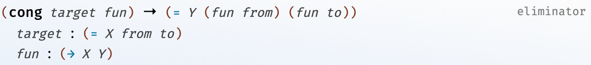

用`cong`来实现`step-+1=add1`的话，我们就可以把`(= Nat (+ n-1 1) (add1 n-1))`类型的`+1=add1-n-1`作为 target，再把一个给任意自然数加一的函数当作`cong`的第二个参数，这样最后`cong`的返回值就是我们想要的`(= Nat (add1 (+ n-1 1)) (add1 (add1 n-1)))`这个命题的证明：

```pie
(claim step-+1=add1
  (Π ((n-1 Nat))
    (-> (= Nat (+ n-1 1) (add1 n-1))
      (= Nat (add1 (+ n-1 1)) (add1 (add1 n-1))))))
(define step-+1=add1
  (λ (n-1 +1=add1-n-1)
    (cong +1=add1-n-1 (+ 1))))
```

请注意这里我们用到了 Pie 的[函数 currying 的特性](#柯里化)，`(+ 1)`就是一个把任意自然数加一的函数。这样我们就完成了对命题的证明：

```pie
(claim +1=add1
  (Π ((n Nat))
    (= Nat (+ n 1) (add1 n))))
(define +1=add1
  (λ (n)
    (ind-Nat n
      (λ (k)
        (= Nat (+ k 1) (add1 k)))
      (same 1)
      step-+1=add1)))
```

可以看到，在 Pie 语言里对命题的证明就是一个实现类型定义的过程，只要写出了类型系统可以接受的实现，也就完成了对命题的证明。解释器对证明的解释是一个静态的过程，我们并不需要去“运行”写好的定义。

有了这些了解后，我们可以着手解决上节结尾处留下来的关于`vec->list`和`list->vec`的正确性证明了。这个命题可以陈述为，“对于任意一个 List，连续应用函数`list->vec`和`vec->list`后得到的结果和它本身相等”。和这个命题等价的类型声明是：

```pie
(claim list->vec->list=
  (Π ((E U)
      (lst (List E)))
    (= (List E)
       lst
       (vec->list E
         (length E lst)
         (list->vec E lst)))))
```

前面证明`+1=add1`的时候，因为是关于自然数的定理，所以用的是`ind-Nat`。现在要证明的是一个关于 List 的命题，自然会选择`ind-List`作为入手点。因为`lst`参数应该作为 target，这样只需要把返回值类型中的`lst`都替换成 motive 函数的参数`xs`就可以得到 motive 的定义：

```pie
(λ (xs)
  (= (List E)
    xs
    (vec->list E
      (length E xs)
      (list->vec E xs))))
```

继而可以知道 base 的类型，即`(motive nil)`的值是：

```pie
(= (List E)
  nil
  (vec->list E
    (length E nil)
    (list->vec E nil)))
```

这个表达式可以简化成`(= (List E) nil nil)`。所以应该用`(same nil)`作为 base 的值。有了 motive 和 base 之后`list->vec->list=`的定义如下：

```pie
(claim list->vec->list=
  (Π ((E U)
      (lst (List E)))
    (= (List E)
       lst
       (vec->list E
         (length E lst)
         (list->vec E lst)))))
(define list->vec->list=
  (λ (E lst)
    (ind-List lst
      (λ (xs)
        (= (List E)
          xs
          (vec->list E
            (length E xs)
            (list->vec E xs))))
      (same nil)
      TODO)))
```

接下来需要确定 step 函数的类型及定义。`ind-List`的 step 参数类型是：

```pie
(Π ((e E)
    (es (List E)))
  (-> (motive es)
    (motive (:: e es))))
```

把`motive`替换成我们写好的定义后得到的类型是：

```pie
(Π ((e E)
    (es (List E)))
  (-> (= (List E)
        es
        (vec->list E
          (length E es)
          (list->vec E es)))
    (= (List E)
      (:: e es)
      (vec->list E
        (length E (:: e es))
        (list->vec E (:: e es))))))
```

这个类型乍看起来比较复杂，直接证明的话可能会觉得无从下手。我们可以试着简化一下最后的返回值类型。根据`length`函数的定义，可以知道`(length E (:: e es))`其实等于`(add1 (length E es))`；同样的，`(list->vec E (:: e es))`表达式也可以简化成`(vec:: e (list->vec E es))`。这样转换后的返回值类型就变成了：

```pie
(= (List E)
  (:: e es)
  (vec->list E
    (add1 (length E es))
    (vec:: e (list->vec E es))))
```

最后再根据`vec->list`的定义，把这个类型进一步简化成：

```pie
(= (List E)
  (:: e es)
  (:: e
    (vec->list E
      (length E es)
      (list->vec E es))))
```

把这个结果带回 step 的类型中，就得到了简化后的 step 类型：

```pie
(Π ((e E)
    (es (List E)))
  (-> (= (List E)
        es
        (vec->list E
          (length E es)
          (list->vec E es)))
    (= (List E)
      (:: e es)
      (:: e
        (vec->list E
          (length E es)
          (list->vec E es))))))
```

现在从假设（`->`的参数）到结论（`->`的返回值）的途径变得更明显了：分别把元素`e`加到假设中的`es`和`(vec-list ...)`表达式的前面。所以仍然可以借助`cong`来写出 step 的定义：

```pie
(λ (e es =-es)
  (cong =-es
    (λ (xs) (:: e xs))))
```

这里`=-es`参数代表的是类型中`->`的参数，即对于`es`来说，等式成立的假设；`(λ (xs) (:: e xs))`是一个把`e`加到任意 List 前面的匿名函数，它会被用来把`e`分别加到`=-es`中的 from 和 to 之前。不过把这个 step 的定义放回`list->vec->list=`的定义中后，解释器却无法确定`(λ (xs) (:: e xs))`的类型：
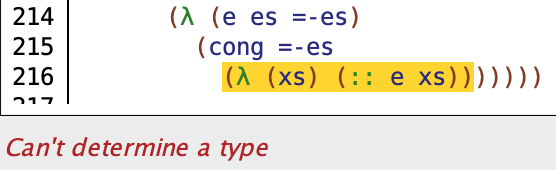

所以我们需要用`the`表达式来加入一个类型提示：

```pie
(λ (e es =-es)
  (cong =-es
    (the (-> (List E) (List E))
      (λ (xs) (:: e xs)))))
```

这样我们就写出了完整的对于`list->vec->list=`命题的证明：

```pie
(claim list->vec->list=
  (Π ((E U)
      (es (List E)))
    (= (List E)
       es
       (vec->list E
         (length E es)
         (list->vec E es)))))
(define list->vec->list=
  (λ (E lst)
    (ind-List lst
      (λ (xs)
        (= (List E)
          xs
          (vec->list E
            (length E xs)
            (list->vec E xs))))
      (same nil)
      (λ (e es =-es)
        (cong =-es
          (the (-> (List E) (List E))
            (λ (xs) (:: e xs))))))))
```

因为类型系统接受了这个定义，也就意味着“对于任意一个 List，连续应用`list->vec`和`vec->list`后值不变”这个定理是成立的。这样我们也就基本能够确定函数`list->vec`和`vec->list`的定义是正确的。为了进一步说明，我们可以试着把`list->vec->list=`的声明和定义·中的`list->vec`换成上节里的`list->vec-wrong`，看看解释器会给出什么样的回应：
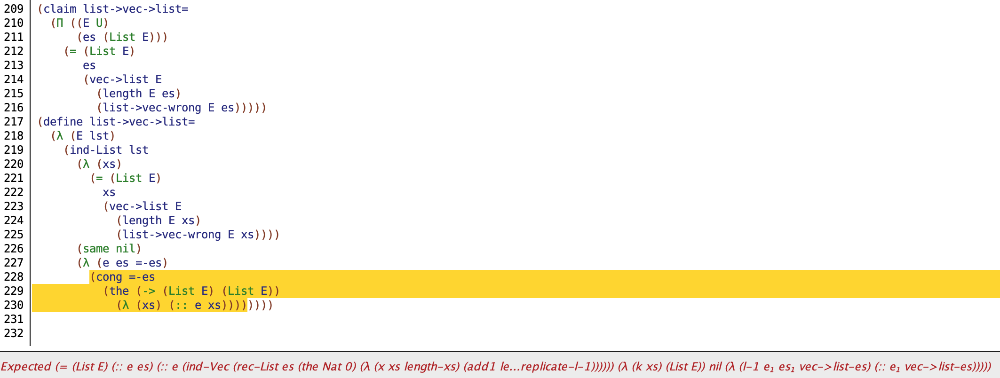

类型系统不再接受这个证明了，虽然错误消息比较抽象，但至少能看出来如果函数定义错误的话，类型系统就会拒绝我们对定理的证明。

### 存在量词

上节说了如果把类型看作定理的话，`Π`就相当于全称量词。那么谓词逻辑中的存在量词在 Pie 的类型中是如何表达的呢。先介绍一个新的类型`Pair`。从名字就可以看出来，一个`Pair`类型的值由两个值组成，这两个值的类型可以相同也可以不同。`Pair`类型可以写作`(Pair A D)`，其中`A`是第一个元素的类型，`D`则是第二个的类型。构造一个`Pair`用到的 constructor 是`cons`:

```pie
(claim a-pair
  (Pair Nat Atom))
(define a-pair
  (cons 5 'men))
```

另外`Pair`有两个 eliminator，`car`和`cdr`，可以分别用来得到第一个和第二个元素：

```pie
> a-pair
(the (Pair Nat Atom)
  (cons 5 'men))

> (car a-pair)
(the Nat 5)

> (cdr a-pair)
(the Atom 'men)
```

就像`Π`表达式是`->`类型的一个更一般的表现形式一样，`Pair`也有一个更通用的类型表达式`Sigma`，也可以简写成希腊字母`Σ`[^9]。`Σ`类型表达式的用法是`(Σ ((x A1) (y A2) ...) D)`，其中`x`和`y`是两个变量，可以出现在类型`D`中。当`Σ`和`=`类型一起使用时，我们就可以把`Σ`看作是存在量词。例如这个类型：

```pie
(Σ ((name Atom))
  (= Atom name 'Jack))
```

可以把它读作，“存在一个`Atom`类型的值`name`，它的值等于`'Jack`”。这个命题的证明也很简单，和`'Jack`相等的`Atom`值也只有`'Jack`：

```pie
(cons 'Jack (same 'Jack))
```

里面的`same`是用来构造`=`类型的值，`cons`是用来构造`Σ`表达式所声明的`Pair`类型的值，这个值也是这个存在命题的证明。

有了存在量词`Σ`，我们可以用它来表达更多有意思的命题了，比如可以用定理来表示某个自然数是否是偶数。回想一下数学书上对偶数的定义：能被 2 整除的数叫做偶数。如果直接套用这个定义的话我们首先需要实现一个针对自然数的除法函数，不过也可以换个思路，能被 2 整除也意味着这个自然数等于另一个数与 2 的乘积，如果把乘法换成加法的话，就是另一个数与自身的和。所以这个偶数命题可以表达为，“如果自然数 n 是偶数，那么存在另一个数 m 使得 n 等于 m + m”。这样“0 是偶数”就可以用类型写成：

```pie
(Σ ((m Nat))
  (= Nat 0 (+ m m)))
```

我们可以进一步把类型中的`0`抽象成一个函数参数，来得到一个生成“某个自然数是偶数”这个定理的函数：

```pie
(claim Even
  (-> Nat U))
(define Even
  (λ (n)
    (Σ ((half Nat))
      (= Nat n (+ half half)))))
```

因为`Even`接受一个自然数类型的参数`n`，返回一个关于`n`的定理（`n`是偶数），而定理即类型，所以`Even`也是一个生成类型的函数，这就需要在声明中把返回值类型写作`U`，而在函数定义中才返回一个`Σ`表达式。现在就可以把“0 是偶数”这个命题声明为：

```pie
(claim zero-is-even
  (Even 0))
```

证明`zero-is-even`这个命题就是去构造一个`(Σ ((half Nat)) (= Nat 0 (+ half half)))`类型的值。因为`0`的一半还是`0`，所以它的证明是：

```pie
(claim zero-is-even
  (Even 0))
(define zero-is-even
  (cons 0 (same 0)))
```

同理，“10 是偶数”这个命题的证明可以写作：

```pie
(claim ten-is-even
  (Even 10))
(define ten-is-even
  (cons 5 (same 10)))
```

我们还知道把任意一个偶数加 2 得到的仍然是偶数，那么如何证明这个定理呢？先写出它的类型声明：

```pie
(claim +two-even
  (Π ((n Nat))
    (-> (Even n)
      (Even (+ 2 n)))))
```

要证明这个命题，就得想办法从`(Even n)`类型也就是`(Σ ((half Nat)) (= Nat n (+ half half)))`类型的值得到`(Even (+ 2 n))`类型即`(Σ ((new-half Nat)) (= Nat (+ 2 n) (+ new-half new-half)))`类型的值。这两个类型里的`half`和`new-half`是有一定关联性的，想一下会发现`new-half`其实等于`(add1 half)`，因为偶数加 2 后的一半比原来的一半大一。所以返回值的`cdr`部分的等式可以进一步写成`(= Nat (+ 2 n) (+ (add1 half) (add1 half)))`。下面是证明的开头部分：

```pie
(define +two-even
  (λ (n)
    (λ (even-n)                 ; (Σ ((half Nat)) (= Nat n (+ half half)))
      (cons (add1 (car even-n)) ; (car even-n) 就是 (Even n) 中的 half
        TODO))))                ; (= Nat (+ 2 n) (+ (add1 half) (add1 half)))
```

如果对比一下`(cdr even-n)`的类型`(= Nat n (+ half half))`和`TODO`的类型`(= Nat (+ 2 n) (+ (add1 half) (add1 half))`，会发现其实后者其实就是把前者的两个加数分别加 2 后得到的（两个`(add1 half)`相加相当于把`(+ half half)`整个加 2）。这样看起我们可以用`cong`从`(cdr even-n)`来得到期望的类型的值：

```pie
(define +two-even
  (λ (n)
    (λ (even-n)
      (cons (add1 (car even-n)) 
        (cong (cdr even-n) (+ 2)))))) ; 错误：类型不匹配
```

但是实际运行的结果是解释器在最后一行报出类型不匹配的错误：
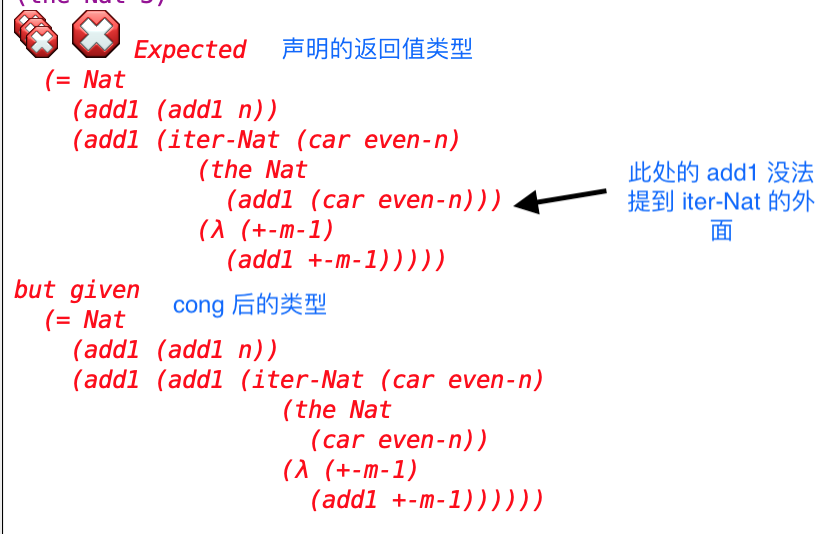
我们用`cong`做的尝试还是失败了，上面的 Expected 指的是声明的类型`(= Nat (+ 2 n) (+ (add1 half) (add1 half))`，下面的 but given 则是表达式`(cong (cdr even-n) (+ 2))`的类型。仔细对比上下两个类型会发现问题出在`(+ (add1 half) (add1 half))`只能把第一个`add1`提到最外层，但是对后一个却无能为力。像我们之前说的，根源还是在`+`函数的定义中是把第一个参数作为了 target。那么我们是不是可以先试着声明“`+`的第二个参数的`add1`也是可以提到最外层的”这个中间定理。这个中间命题的证明可以被用来把上图中不匹配的两个类型串到一起。下面就是这个中间定理的声明：

```pie
(claim lift-right-add1
  (Π ((n Nat)
      (m Nat))
    (= Nat (add1 (+ n m)) (+ n (add1 m)))))
```

这里`=`类型的 from 部分的`add1`在`+`的外面，to 部分的`add1`则在第二个加数的前面，如果 from 和 to 相等也就意味着第二个加数前的`add1`是可以提到`+`函数外层的。这是个关于自然数的命题，可以用`ind-Nat`来证明：

```pie
(define lift-right-add1
  (λ (n m)
    (ind-Nat n
      (λ (k)
        (= Nat (add1 (+ k m)) (+ k (add1 m))))
      (same (add1 m))
      (λ (n-1 lra-n-1)  ; (= Nat (add1 (+ n-1 m)) (+ n-1 (add1 m)))
        TODO))))        ; (= Nat (add1 (+ (add1 n-1) m)) (+ (add1 n-1) (add1 m)))
```

这里为了让证明更简单，选择把第一个参数`n`作为 target。注释中分别写出了`lra-n-1`和`TODO`的类型，`TODO`的类型可以通过把两个`n-1`前面的`add1`都提到最外层进一步简化成`(= Nat (add1 (add1 (+ n-1 m))) (add1 (+ n-1 (add1 m))))`，这样我们就又可以用`cong`来证明了：

```pie
(define lift-right-add1
  (λ (n m)
    (ind-Nat n
      (λ (k)
        (= Nat (add1 (+ k m)) (+ k (add1 m))))
      (same (add1 m))
      (λ (n-1 lra-n-1)            ; (= Nat (add1 (+ n-1 m)) (+ n-1 (add1 m)))
        (cong lra-n-1 (+ 1))))))  ; (= Nat (add1 (add1 (+ n-1 m))) (add1 (+ n-1 (add1 m))))
```

有了`lift-right-add1`，剩下的问题就是怎样用它来解决`+two-even`中类型不匹配的问题，再回顾总结一下这个问题。我们声明的类型（也就是要证明的命题）是`(= Nat (+ 2 n) (+ (add1 half) (add1 half)))`，现在已经从已有的`(Even n)`类型的值`even-n`通过`cong`得到了一个类型是`(= Nat (+ 2 n) (add1 (add1 (+ half half))))`的值`(cong (cdr even-n) (+ 2))`。这两个类型不匹配的原因是`(+ (add1 half) (add1 half))`的第二个`add1`没法提到`+`的外层，所以我们又证明了可以把第二个`add1`提出来的中间定理`lift-right-add1`，现在的问题就是怎样用这个中间定理把我们已有的类型转成要得到的类型。这就要用到`=`类型的另一个叫作`replace`的 eliminator 了：
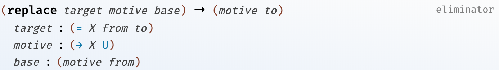
直接从`replace`的这个类型描述上看它的用法不是很直观，所以我们结合`+two-even`中要解决的问题来说明一下：
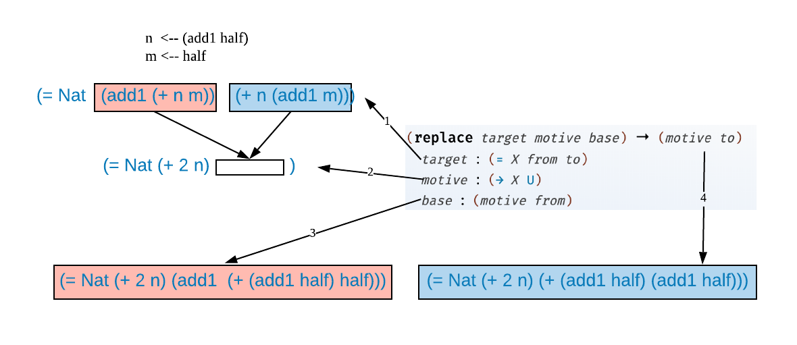
上图中，箭头 1 指向的是中间定理`lift-right-add1`，我们把它作为`replace`的 target。箭头 2 指向的是`replace`的 motive，里面的空白方框代表的是`motive`的参数。target 的红蓝两部分对应的分别是`=`表达式的 from 和 to。当把红色的 from 作为参数传给 motive 时，得到是我们已有的类型，也就是箭头 3 指向的红色表达式，而这个类型的证明正是我们用`cong`所得到的值`(cong (cdr even-n) (+ 2))`。这里需要说明的是因为`lift-right-add1`是作用于任意自然数`n`和`m`的定理，这里我们需要把`n`和`m`分别换成`(add half)`和`half`。

最后当把蓝色的部分传递给 motive 后，得到的就是我们要证明的命题（箭头 4 所指），而`replace`表达式的返回值就是这个命题的证明。从逻辑上来理解`replace`可能会更容易一些，它表达的想法其实就是，如果我们有两个等价的命题，target 的 from 和 to，如果能给出 from -> U（`(motive from)`）这个命题的证明（`replace`的 base），那么就可以得到 to -> U（`(motive to)`）这个命题的证明。现在我们有了`+two-even`的证明的最后一块拼图了：

```pie
(claim +two-even
  (Π ((n Nat))
    (-> (Even n)
      (Even (+ 2 n)))))
(define +two-even
  (λ (n)
    (λ (even-n) ; (Σ ((half Nat)) (= Nat n (+ half half)))
      (cons (add1 (car even-n))
        (replace (lift-right-add1
                   (add1 (car even-n))
                   (car even-n))
          (λ (k)
            (= Nat (+ 2 n) k))
          (cong (cdr even-n) (+ 2)))))))
```

这段程序里的`(car even-n)`是`(Even n)`类型中的`half`，`(cdr even-n)`是`(Even n)`中的等式。而`(lift-right-add1 (add1 (car even-n)) (car even-n))`其实就是把中间定理`lift-right-add1`里的`n`和`m`分别换成`(add1 (car even-n))`和`(car even-n)`。

费尽辛苦终于得到了命题`+two-even`的证明，不过这份“辛苦”也许并不是很必要😅。 像前面提到的，这个证明的困难根源于`+`函数的第二个参数如果是`(add1 ...)`的形式，这个`add1`是没法拿到`+`外面的。那么如果我们换一种方式定义`Even`，使得`+`不再出现，是不是`+two-even`也会变得更加容易证明呢？比如我们可以定义一个函数`double`：

```pie
(claim double
  (-> Nat Nat))
(define double
  (λ (n)
    (rec-Nat n
      0
      (λ (n-1 double-n-1)
        (+ 2 double-n-1)))))
```

这个定义递归地遍历参数`n`中的每个`add1`，然后将其替换成两个`add1`，所以最终结果就是一个二倍于参数`n`的自然数。接下来用`double`来定义一个新的`Even-with-double`：

```pie
(claim Even-with-double
  (-> Nat U))
(define Even-with-double
  (λ (n)
    (Σ ((half Nat))
      (= Nat n (double half)))))
```

`Even-with-double`表达的想法和`Even`是一致的，区别只在于前者用的`double`实现，而后者用的是`+`。现在对基于`Even-with-double`的命题`+two-even`的证明就变得简单了多：

```pie
(claim +two-even-with-double
  (Π ((n Nat))
    (-> (Even-with-double n)
      (Even-with-double (+ 2 n)))))
(define +two-even-with-double
  (λ (n)
    (λ (even-n)
      (cons (add1 (car even-n))
        (cong (cdr even-n) (+ 2))))))
```

可以看到这次不再需要用到`replace`，因为根据定义，`(double (add1 half))`可以直接变为`(add1 (add1 (double half)))`，这样表达式`(cong (cdr even-n) (+ 2))`的类型也就和期望的返回值类型一致了。所以可以看出来，不同的命题表达形式会影响到证明的难易程度。一般来说，选择能让参数“更快”得缩减到最简形式的函数来定义命题的话，会使证明更简单。

## 结尾

到这里本文对 Pie 语言中的定理证明的介绍已经完结，这篇文章也接近尾声了。其实最开始只是想写一篇《The Little Typer》的读后感，结果慢慢地发展（啰嗦）到了这么长。如果读过本文升起了一丝对依赖类型或定理证明的兴趣，强烈推荐继续读一下《The Little Typer》这本书，它远比本文有趣的多，而且还有很多有意思的概念这里限于篇幅也没办法一一介绍。如果想了解依赖类型的一些更“实际”的应用场景，可以看一下本文开头所提的 Idris 语言，以及该语言作者的书《Type-Driven Development with Idris》。另外，如果想从更理论的方向掌握定理证明的话，这本在线的教科书[《Software Foundations》](https://softwarefoundations.cis.upenn.edu/current/index.html)，以及配套的编程语言 [Coq](https://coq.inria.fr/) 会是个不错的选择。

[^1]: 类型可以出现在普通的表达式中，比如可以把类型作为参数传递给函数，函数也可以把类型像值一样返回。
[^2]: 比如著名的[四色定理](https://en.wikipedia.org/wiki/Four_color_theorem)的证明就是在 1976 年由计算机的定理证明程序来辅助推导得出的。
[^3]: 在 DrRacket 中可以通过快捷键 ⌘-\ 输入字母 λ。
[^4]: `::` 读作 cons（/ˈkɑnz/），继承自 Lisp 语言。
[^5]: 可以通过下图的菜单导入[这个文件](./dt/keybindings.rkt)，之后就可以直接在 DrRacket 里按 Ctrl-[ 输入字母 Π。
      
[^6]: 关于 parameter 和 index 的更详细准确的区别可以参考 [stackoverflow 上的这个问题](https://stackoverflow.com/questions/24600256/difference-between-type-parameters-and-indices)。
[^7]: motive 这个名字应该是来自[这篇论文](http://www.cs.ru.nl/F.Wiedijk/courses/tt-2010/tvftl/conor-elimination.pdf)。
[^8]: [《计算进化史》](https://book.douban.com/subject/26975991/)这本书里有比较深入的关于这方面的讨论。
[^9]: 如果已经导入了脚注 5 中的文件的话，可以在 DrRacket 里按 Ctrl-] 来输入字母 Σ。
